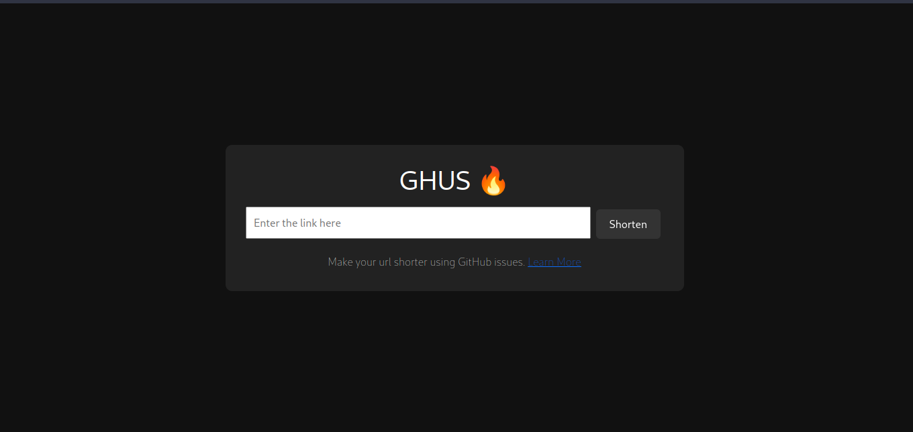

# GSHU 🔥

Make short urls with github issues. [Learn more.](https://github.com/rooyca/short)



## 🧪 Try it out

- [https://divine-sound-5320.fly.dev/](https://divine-sound-5320.fly.dev/)

## 🚀 How to use

Paste a link into the input field and click on the button. You will get a short url. You can use it to redirect to the original link.

Because we are using my instance, wich is hosted on github pages, the link will be like this:

```bash
https://rooyca.github.io/short/9
```

If you want to use your own instance, you can fork [this repo](https://github.com/rooyca/short) and follow the [instructions](https://github.com/Rooyca/short/blob/main/README.md#-this-is-so-cool-how-can-i-use-this-with-my-own-domain).

You can also run your own instance of this app. For that, you'll need:

1. Create a github access token with the `public_repo` scope. [Learn more.](https://docs.github.com/en/authentication/keeping-your-account-and-data-secure/managing-your-personal-access-tokens#creating-a-personal-access-token-classic)
2. Rename the `.env.example` file to `.env` and paste your token there. If you are using your own instance, you can also change the `GITHUB_REPOSITORY_OWNER`, `GITHUB_REPOSITORY_NAME`, `URL_SHORTENER` variables.
3. Run the app. (I recommend using a virtual enviroment. [Learn more.](https://docs.python.org/3/tutorial/venv.html))

```bash
pip install -r requirements.txt
python -m uvicorn github.main:app --reload
```

## 📝 License

[MIT](LICENCE)